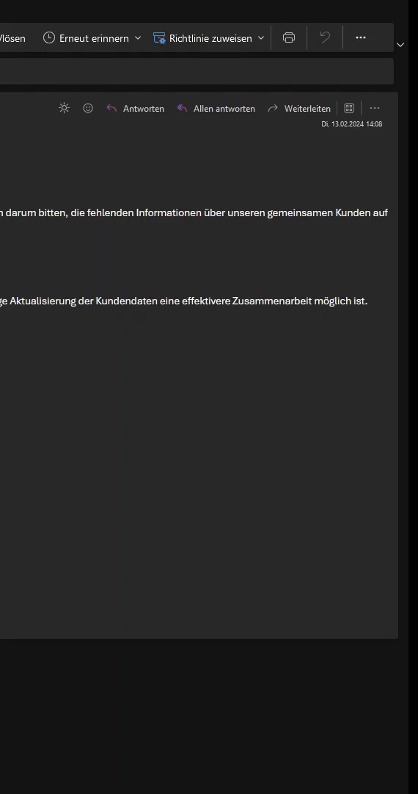

# GophishReport
Outlook Add-In for reporting Gophish Mails, for the old and new Outlook Client.

This Add-In enables users to report supected phishing mails to a Gophish instance without having to manually open the report link or forward the mail to a designated IMAP mailbox.
 

<h2>How to set up</h2>

Simply download the "manifest.xml" file and manually install the Add-In to your Outlook Client.

You can manually install per user, see following Microsoft documentation: [Link](https://learn.microsoft.com/en-us/office/dev/add-ins/outlook/sideload-outlook-add-ins-for-testing?tabs=windows-web#sideload-manually)  

Or you can deploy it to multiple users at once through the admin center: [Link](https://learn.microsoft.com/en-us/microsoft-365/admin/manage/manage-deployment-of-add-ins?view=o365-worldwide#deploy-an-office-add-in-using-the-admin-center)  

All the files accessed by the Add-In are hosted using GitHub Pages  
  
Outlook Web Add-Ins have the advantage of being compatible with both the old and new versions of the client, as well as working seamlessly in OWA.  

<h2>User experience</h2>

When the user opens a mail he can find the Goreport Add-In next to his other Add-Ins.
He then can press a button to report the mail.
 

<h2>How does it work</h2>

The Add-In uses regex to parse the mail content and search for a Gophish link.
If it finds a Gophish link:
 
It transforms the link to a report link and launches a fetch request to that report link.
The report is logged and displayed in your Gophish instance, the user receive confirmation that the mail was reported and can be deleted:
 
  
  
 
If it doesn't find a Gophish link:
 
No fetch request is made, but the user still receives confirmation that the mail was reported.
The reason for that is, that way the user isn't directly able to tell which phishing mails are created by your Gophish instance and which are actual phishing mails.
(There is still a DEV text shown if no Gophsih link is found, this will be removed in an upcoming update)
 

<h2>Why doesn't the Add-In automatically remove the reported mail?</h2>

Outlook Web Add-Ins can't interact with mails in that way.
To be able to move or delete mails, you would need to use the Graph API. This is doable but it would require a more complex backend and would be difficult to realize if you need to serve this to multiple customers with different tenants, for example if you're an MSP.
